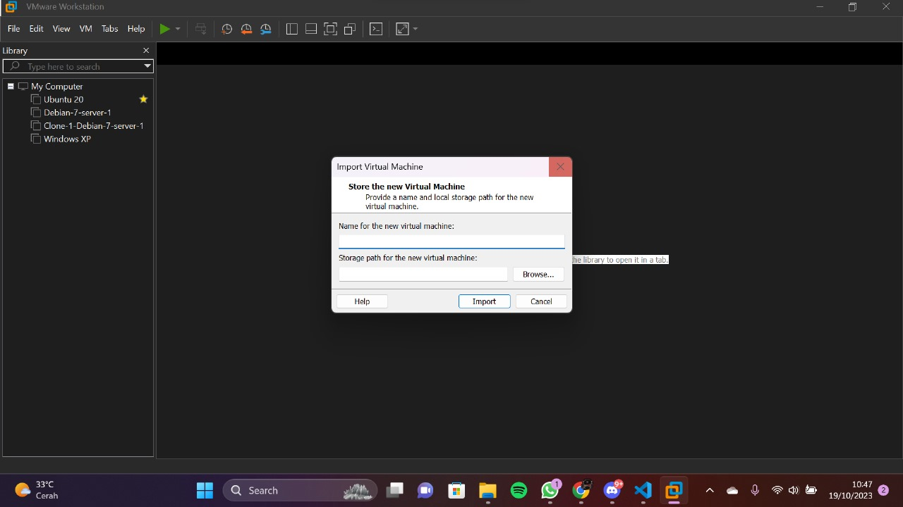

# PNETLab Lucky

## Cara Mendownload PnetLab 

- Pertama - tama, download pnetlab dari browser dibawah

[Download PNETLab](https://pnetlab.com/pages/download){ .md-button .md-button--primary }

- Kedua, Setelah selesai mendownload Pnetlab. buka folder Pnetlab, click kanan dan open with VmWare. Seperti gambar dibawah:

- ketiga, Masukan nama `PnetLab` di bagian import

- Keempat, Setelah selesai import. Setting PNETLab seperti gambar dibawah:

